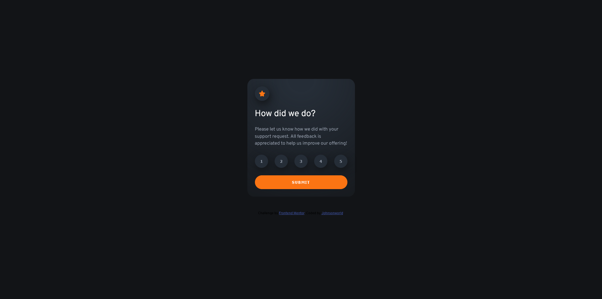
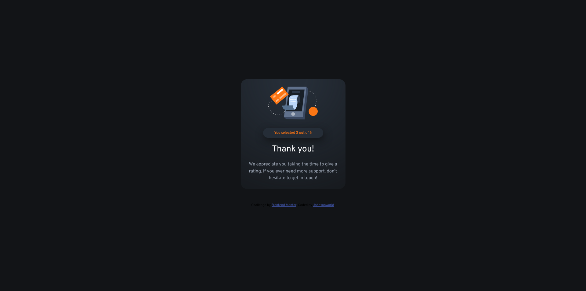

# Frontend Mentor - Interactive rating component solution

This is a solution to the [Interactive rating component challenge on Frontend Mentor](https://www.frontendmentor.io/challenges/interactive-rating-component-koxpeBUmI). Frontend Mentor challenges help you improve your coding skills by building realistic projects. 

## Table of contents

- [Overview](#overview)
  - [The challenge](#the-challenge)
  - [Screenshot](#screenshot)
  - [Links](#links)
- [My process](#my-process)
  - [Built with](#built-with)
  - [What I learned](#what-i-learned)
  - [Continued development](#continued-development)
 

## Overview

### The challenge

Users should be able to:

- View the optimal layout for the app depending on their device's screen size
- See hover states for all interactive elements on the page
- Select and submit a number rating
- See the "Thank you" card state after submitting a rating

### Screenshot

### Links

[Solution URL here](https://github.com/Johnsonworld/FEMentor-Interactive-Rating)
[Live site URL:](https://johnsonworld.github.io/FEMentor-Interactive-Rating/)

## My process

### Built with

- Semantic HTML5 markup
- CSS custom properties
- Flexbox
- Mobile-first workflow
- Javascript

### What I learned

Feeling pretty comfortable in HTML & CSS, this was my first HTML, CSS & Javascript challenge - so the integration process was a good experience.

I struggle trying to match the colors to the preview images, I think due to my monitor settings.  Next time I'll try upgrading so I can get the Figma files and have more certainty.

CSS custom radio buttons - should have done the star selectors with this but couldn't get them to customize correctly.  I think it was because I started out just using buttons and then tried to convert to radio buttons.  If I did it over I'd start fresh and try to do the custom radio buttons, taking care of that functionality for only allowing one button to be clicked at a time.  Ended up having to do that in JS.

My use of Git/Github getting much more consistent and clean! 

### Continued development

- Need to get much more practice in Javascript fundamentals particularly Get/Set and Document methods.  
- It's not pretty right now - but it works.  Would like to write cleaner and more efficient code.

